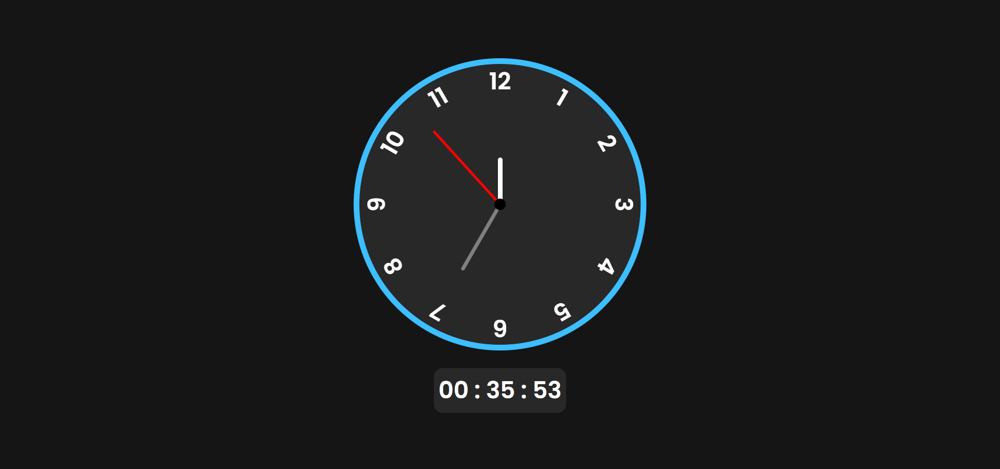
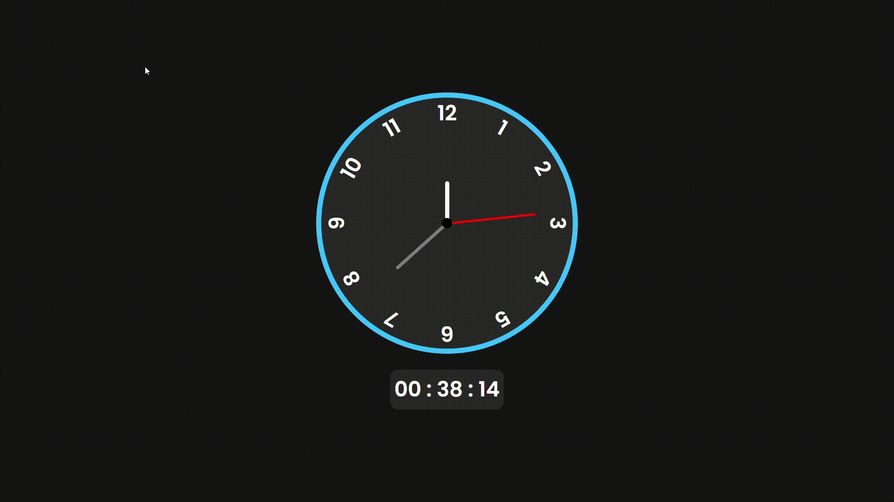

# Relógio Analógico Web 🕰️

Este é um simples, mas elegante relógio analógico desenvolvido utilizando HTML, CSS e JavaScript puro. Oferecendo um design limpo, funcionalidade precisa e a capacidade de personalização, este relógio é uma adição encantadora a qualquer projeto web.

## Demonstração

## Características Principais

- **Design Atraente:** Moldura circular e ponteiros finos para uma estética elegante.
  
- **Interatividade:** Movimento suave dos ponteiros proporciona uma representação precisa do tempo.

- **Tempo Real:** Acompanhe o tempo em tempo real para uma funcionalidade precisa.

## Como Usar

1. Acesse o projeto clicando aqui: -> [Relogio Analogico](https://codeclayton.github.io/Relogio-Analogico/)

## Contribuições

Contribuições são bem-vindas! Sinta-se à vontade para reportar problemas, sugerir melhorias ou enviar pull requests.

## Licença

Este projeto é licenciado sob a [Licença MIT](LICENSE).

---
